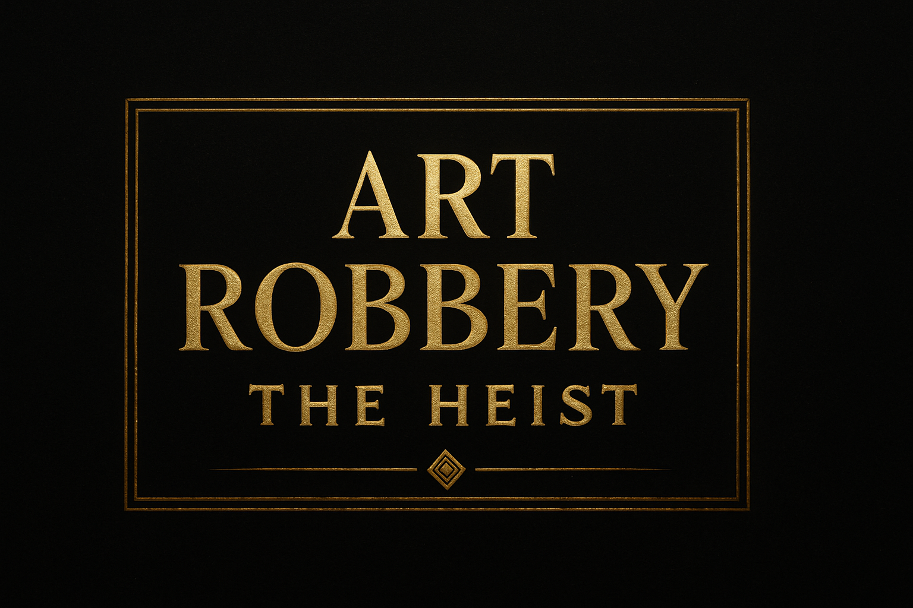
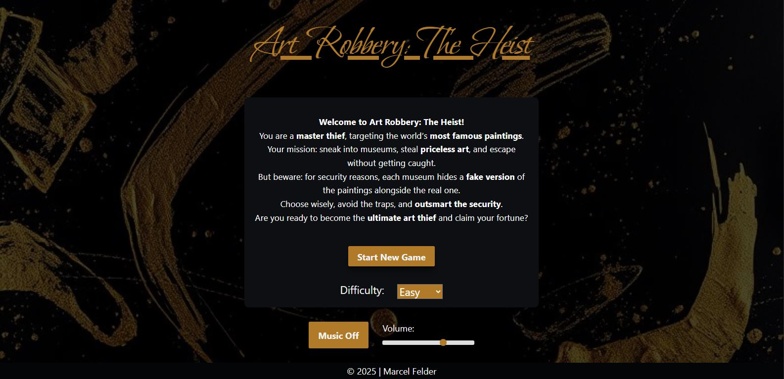
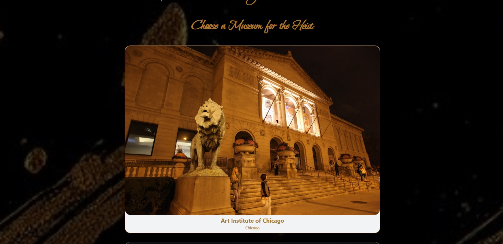
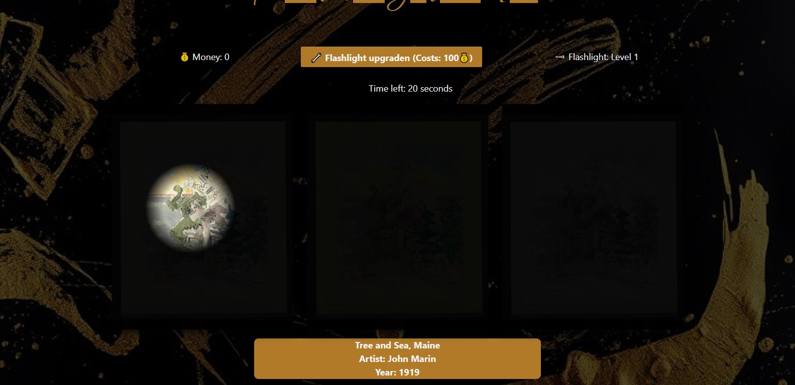
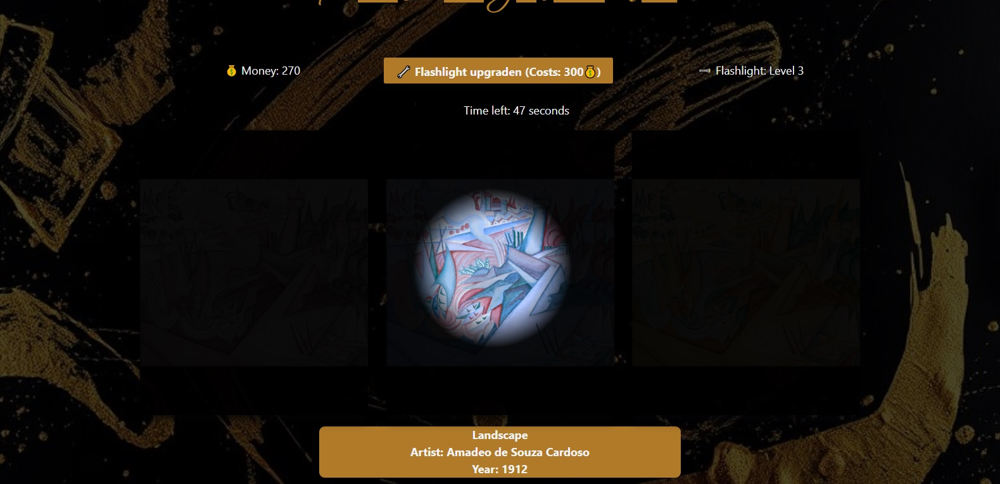

## 📑 Table of Contents
- [Short Description](#short-description)
- [Showcase](#showcase)
- [Key Features](#key-features)
- [Technologies Used](#technologies-used)
- [Challenges & Lessons Learned](#challenges--lessons-learned)
- [How to Get Started (Local Setup)](#how-to-get-started-local-setup)
- [Live Demo](#live-demo)

## Short Description
**Welcome to Art Robbery: The Heist!**  
You are a **master thief**, targeting the world’s **most famous paintings**.  
Your mission: sneak into museums, steal **priceless art**, and escape without getting caught.  

But beware: each museum hides a **fake version** of the paintings alongside the real one.  
Choose wisely, avoid the traps, and **outsmart the security**.  

Are you ready to become the **ultimate art thief** and claim your fortune?

---

## Showcase

### Screenshots
<p align="center">
  
</p>
<p align="center">
  
</p>
<p align="center">
  
</p>
<p align="center">
  
</p>


### GIF Demo


### YouTube Demo Video
[Watch the Demo on YouTube](https://youtu.be/Qeo3M6nn7ec)  

---

## Key Features 

- **Museum Heist Gameplay:** Explore museums filled with world-famous paintings and uncover which artwork is real.
- **Real Art Integration:** Paintings are fetched live from a public art API, showcasing masterpieces from renowned museums around the world.
- **Deception Mechanic:** Each painting has multiple versions. Only one is authentic, while others are fakes with subtle differences.
- **Flashlight Inspection:** Use a flashlight mechanic (mask effect) to reveal painting details hidden in the dark.
- **Difficulty Scaling:** Fake versions are altered with filters of varying intensity depending on the chosen difficulty.
- **Upgrade System:** Earn money for quick and successful heists to upgrade your flashlight and improve your chances.
- **High-Stakes Challenge:** Outsmart security, choose wisely, and steal the real painting before time runs out.

---

## Technologies Used 
- **Frontend:** React, JavaScript, HTML, CSS  
- **State Management:** React useState & useContext
- **Styling:** Modular CSS

---

## Challenges & Lessons Learned
- **API Handling:** Learned how to fetch artwork data from an API and dynamically display it in the interface.  
- **Interactive UI:** Implemented a "flashlight" effect that acts as a mask, allowing users to inspect paintings in detail.  
- **Dynamic Difficulty & Rewards:** Created filters that adjust the intensity of the images based on difficulty, and a reward system where users earn in-game money by identifying the correct artwork quickly.  
- **State Management:** Managing the flashlight position, filters, and user rewards taught me efficient state handling in React.  
- **UI/UX Design:** Learned to design a visually engaging and interactive experience that encourages exploration and strategy.


---

## How to Get Started (Local Setup)
To run this project locally, follow these steps:

1. Clone the repository:  
   ```bash
      git clone https://github.com/MarcelFelder-git/01_art_robbery
   ````
   
2. Navigate to the project directory:
   ```bash
      cd art-robbery
   ````

3. Install dependencies:
   ```bash
     npm i
   ````
   
4. Start the application:
   ```bash
      npm run dev
   ````

---

## Live Demo 
You can try out the live version of Art Robbery here:  
[Art Robbery on Vercel](https://01-art-robbery.vercel.app/)

---

## Data Source
Artworks are fetched from the [Art Institute of Chicago API](https://api.artic.edu/docs/),  
which provides open access to thousands of artworks from the museum’s collection.  
Special thanks to the Art Institute of Chicago for making this data publicly available.  
